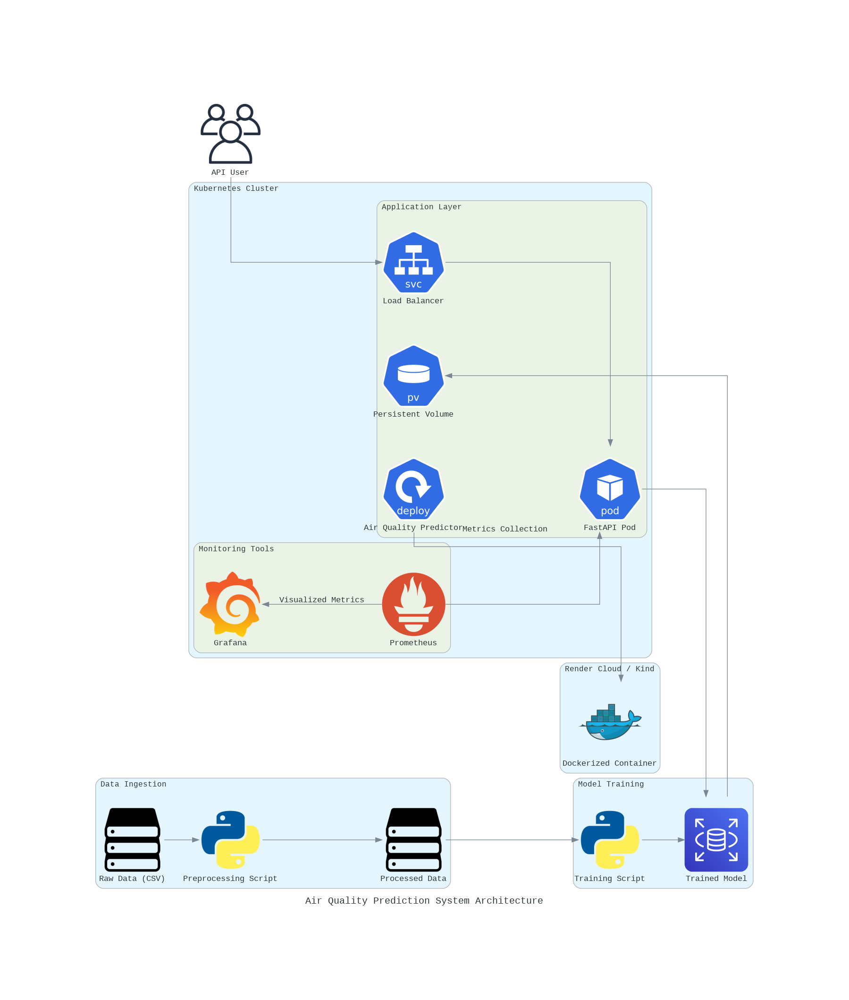

# Air Quality Prediction Project

## Description of the Problem

Air pollution poses a significant threat to public health and the environment. Accurately predicting air quality can help governments, industries, and individuals take proactive measures to reduce its impact. This project develops a robust machine learning model that predicts air quality based on environmental and demographic metrics. The solution is deployed as a web service, enabling seamless integration with monitoring applications and decision-making tools.

---

## Architecture Diagram



---

## Instructions to Run the Project

### Prerequisites

- Install Docker and Kubernetes (e.g., Kind or Minikube).
- Optionally set up Prometheus and Grafana for monitoring.
- Clone the repository:
  ```bash
  git clone https://github.com/kostas696/ml-zoomcamp
  cd ml-zoomcamp/capstone_1
  ```

### Set Up the Environment

1. Create and activate a virtual environment:
   ```bash
   python -m venv air_quality_env
   source air_quality_env/bin/activate
   ```

2. Install dependencies:
   ```bash
   pip install -r requirements.txt
   ```

---

### Run Locally

1. Preprocess the data and generate artifacts:
   ```bash
   python src/preprocessing.py
   ```

2. Train the model:
   ```bash
   python src/train.py
   ```

3. Serve the model:
   ```bash
   uvicorn src.predict:app --reload
   ```

4. Test the service:
   - **Health Check:**
     ```bash
     curl http://127.0.0.1:8000
     ```
   - **Prediction:**
     ```bash
     curl -X POST http://127.0.0.1:8000/predict      -H "Content-Type: application/json"      -d '{
         "temperature": 25.0,
         "humidity": 50.0,
         "pm10": 10.5,
         "no2": 5.0,
         "so2": 2.5,
         "co": 1.0,
         "proximity_to_industrial_areas": 3.0,
         "population_density": 1500
     }'
     ```

---

### Containerization and Deployment

#### Build and Run the Docker Container

1. Build the Docker image:
   ```bash
   docker build -t air-quality-predictor .
   ```

2. Run the Docker container:
   ```bash
   docker run --env-file .env -p 8000:8000 air-quality-predictor
   ```

#### Kubernetes Deployment

1. Load the Docker image into the Kubernetes cluster:
   ```bash
   kind load docker-image air-quality-predictor --name air-quality-cluster
   ```

2. Apply the Kubernetes configurations:
   ```bash
   kubectl apply -f kubernetes/
   ```

3. Access the service:
   ```bash
   kubectl port-forward service/air-quality-service 8000:8000
   ```

4. Test the service as described above.

#### Cloud Deployment (Render)

1. Push the Docker image to Docker Hub:
   ```bash
   docker tag air-quality-predictor kostas696/air-quality-predictor
   docker push kostas696/air-quality-predictor
   ```

2. Configure the Render service:
   - Select Docker as the deployment option.
   - Use `kostas696/air-quality-predictor` as the image.
   - Set environment variables:
     - `PREPROCESSOR_PATH=/app/data/processed/preprocessor.pkl`
     - `MODEL_PATH=/app/models/final_model.pkl`
     - `LABEL_ENCODER_PATH=/app/data/processed/label_encoder.pkl`

3. Test the deployed service at: [Air Quality Predictor on Render](https://air-quality-predictor.onrender.com)

4. Explore and test the API interactively at: [Air Quality Predictor API](https://air-quality-predictor.onrender.com/docs). 
     - You can submit prediction requests directly from the /docs page and see real-time responses.

---

## Data

### Dataset

The dataset is publicly available on Kaggle: [Air Quality Dataset](https://www.kaggle.com/datasets/mujtabamatin/air-quality-and-pollution-assessment).

#### Features:
- Temperature
- Humidity
- PM10
- NO2
- SO2
- CO
- Proximity to industrial areas
- Population density

---

## Insights from the Notebook

### Key Observations for Target Variable

#### Target Variable: Air Quality
- **Distribution**: The target variable "air_quality" has four categories: Good, Moderate, Poor, and Hazardous.
- **Imbalance**: 
  - The majority class (Good) accounts for 40% of the total samples.
  - The Hazardous class represents only 10% of the data, indicating significant class imbalance.
- **Real-World Impact**:
  - Misclassifying Hazardous air quality as Good or Moderate could lead to severe consequences.
  - Evaluating models with weighted metrics (e.g., Weighted F1-Score) ensures all classes are fairly represented.

---

## Modeling Highlights

- **Feature Importance**: Carbon Monoxide (CO) and proximity to industrial areas were the most critical features, followed by NO2 and SO2.
- **Best Performing Model**: 
  - **CatBoost** achieved a Weighted F1-Score of **0.9578** after hyperparameter tuning.
  - XGBoost and LightGBM were strong competitors, with scores of **0.9497** and **0.9491**, respectively.
- **Class Imbalance Handling**: 
  - Applied class weights to ensure fair evaluation and prediction accuracy for minority classes.
  - Evaluated per-class recall to ensure critical cases (Hazardous) were accurately predicted.

---

## Deployment Configuration

### Dockerfile

Defines:
- Base image: `python:3.9-slim`
- Required dependencies and environment variables.
- Configuration to serve the FastAPI app.

### Kubernetes

The `kubernetes/` folder includes:
- Deployment and Service configurations for the app.
- Prometheus and Grafana configurations.

---

## Monitoring

### Prometheus

- Scrapes metrics from the `/metrics` endpoint.
- Monitors request counts, response times, and error rates.

### Grafana

- Visualizes metrics from Prometheus.
- Includes dashboards for:
  - Request counts
  - Latencies
  - Uptime metrics

---

## References

- [FastAPI Documentation](https://fastapi.tiangolo.com/)
- [Prometheus Documentation](https://prometheus.io/docs/)
- [Grafana Documentation](https://grafana.com/docs/)
- [Render Deployment](https://render.com/)